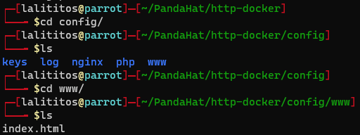

Alright so my first thought was to set it up through docker, as its easy, fast, and lightweight compared to a full virtual machine. 

First I created a virtual machine, with Parrot os, for anything pandahat related to not bloat my own system. After some basic resolution changes, giving it a static ip, and enabling SSH, we got a terminal. 


Then I installed docker and docker-compose
Although docker-compose isn't needed, I like it as you create a yaml file each time
and its easy to modify and re-up the container compared to fully typing the docker command each time. 

```shell
sudo apt install docker docker-compose
```


Now lets create the directory and make the docker compose file


```shell
version: "2.1"
services:
    nginx:
        image: lscr.io/linuxserver/nginx:latest
    container_name: pandaHTTP
    environment:
      - PUID=1000
      - PGID=1000
      - TZ=America/Puerto_Rico
    volumes:
      - /home/lalititos/PandaHat/http-docker/config:/config
    ports:
      - 80:80 # we want only port 80
    restart: unless-stopped
```

Lets create the config folder, where we will keep our nginx configuration.

```shell
mkdir config
```

Then start the docker compose file

```shell
sudo docker-compose up -d --force-recreate
```

I always run my containers with -d, where they run in the background "detacahed", and force-recreate where if the container exists, it replaces it, well with force. Some containers don't shutdown properly.


If we take a look into the config folder, we can see the www directory which is where the index.html file lives.



We can now travel to the ip address of the machine utilizing any web browser, and...


Where what we see is the index file in the www directory:


If we modify the index.html, for example we change the body,


and refresh the website,


it updates.
