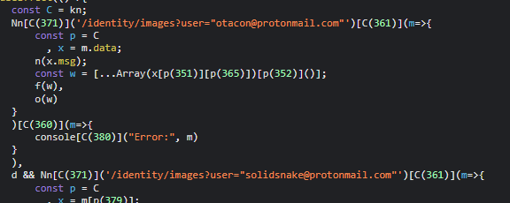
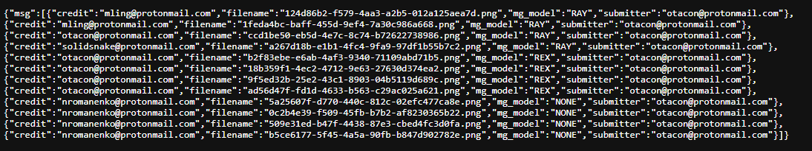
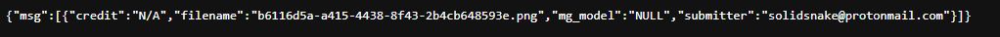
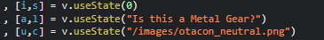
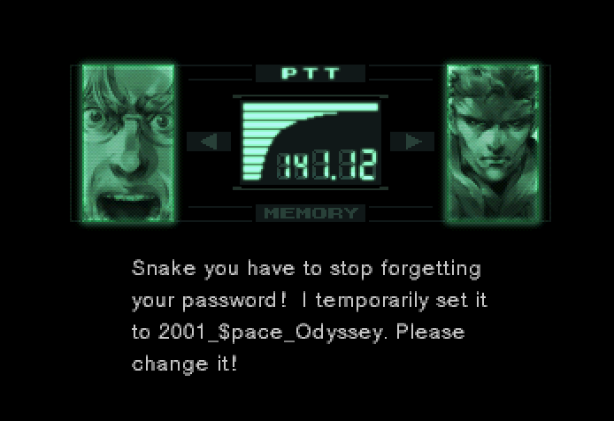
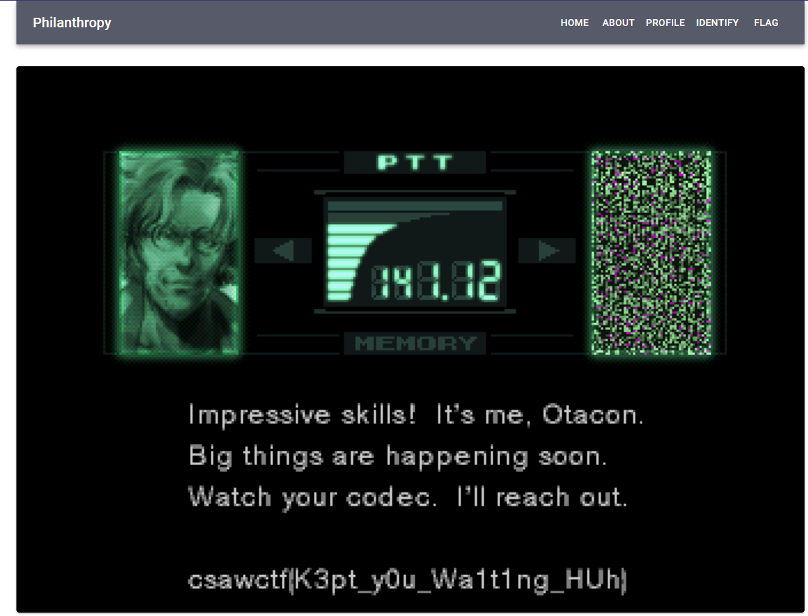

When you get to the site you notice a register and login page. I went ahead and created a temporary account and logged in. Then there was an upgrade section that asked for a member ship code. I went digging in the javascript and noticed this: 

I went ahead and put both in the browser and found this. 

Thanks to this being above in the javascript, I knew where the images would be located at. 

After going through most of the ones in the first picture, I noticed they were general and not related to the flag. I then checked out the solidsnake one. 

And since I had the email... 

solidsnake@protonmail.com

I used it to log in. Then I found the flag section... 

