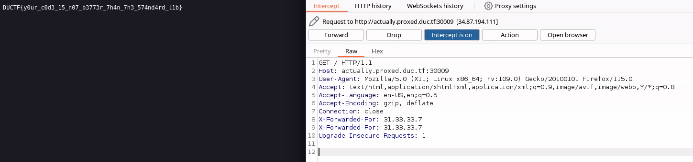

In the code you eventually find 2 important tid bits, in the secret server theres this code block: 

```
xff := r.Header.Values("X-Forwarded-For")

ip := strings.Split(r.RemoteAddr, ":")[0]

if xff != nil {
	ips := strings.Split(xff[len(xff)-1], ", ")
	ip = ips[len(ips)-1]
	ip = strings.TrimSpace(ip)
}

if ip != "31.33.33.7" {...
```

Plus in the previous "reverse proxy you see: "

```
for i, v := range headers {
		if strings.ToLower(v[0]) == "x-forwarded-for" {
			headers[i][1] = fmt.Sprintf("%s, %s", v[1], clientIP)
			break
		}
	}
```

The code tries to find the first x-forwarded for, does something dumb, and breaks.
So if we just add 2 x-forwarded for equal to the ip above, 31.33.33.7 it should ideally work...




and it does!

flag: DUCTF{y0ur_c0d3_15_n07_b3773r_7h4n_7h3_574nd4rd_l1b}
