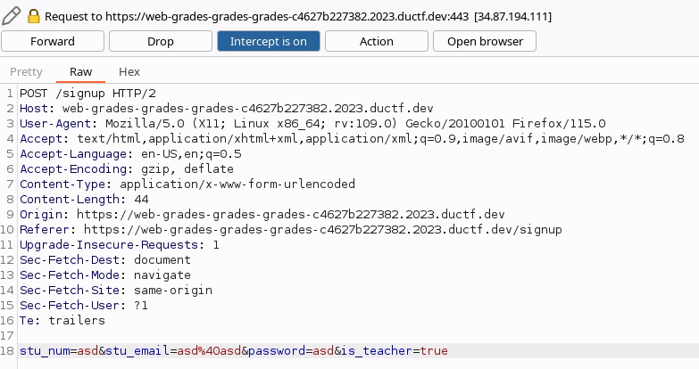
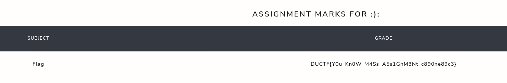

If you look at the auth script, its fairly clean and its looking for the flag "is_teacher". I tried creating an account, and using the jwt token and modifying it with jwt.io to add the flag, but as I dont have the secret it did not work.

If you then look in the sign up script, it takes everything that its given and creates the jwt token for us. So if we pass the "is_teacher: true" into the sign up script it should allow us access.

```
 if request.method == 'POST':
        jwt_data = request.form.to_dict()
        jwt_cookie = current_app.auth.create_token(jwt_data)
        if is_teacher_role():
            response = make_response(redirect(url_for('api.index', is_auth=True, is_teacher_role=True)))
        else: ...
```





