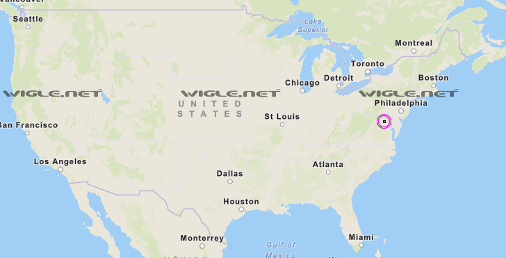
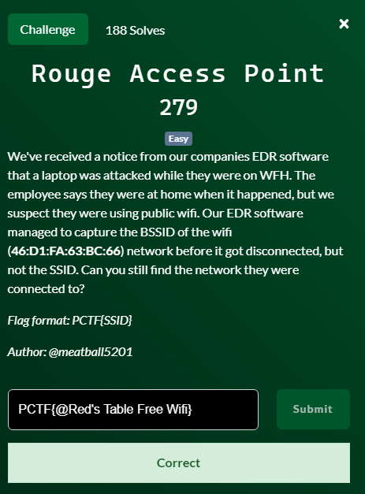

You're given a bssid and need to find an ssid. Something I knew from back in my day when I jailbroke my iphone is that sharing location also shared your ssid and its location, which companies usually sell. This also means that theres a public database of all bssid and ssid plus their longitude and lattitude. 
I went ahead and signed up for wigle https://wigle.net/index , and input the bssid
filtered by it and zoomed out. I noticed there was a dot near Washington DC and zoomed in. 

Once you zoom in enough, you see this: 

