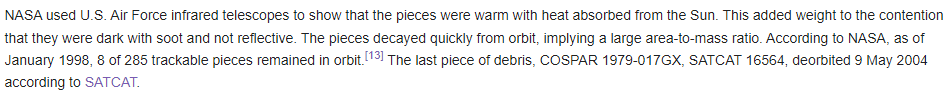
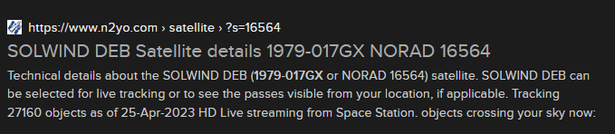
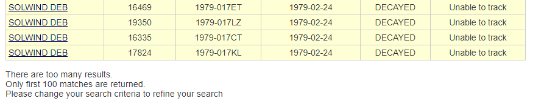
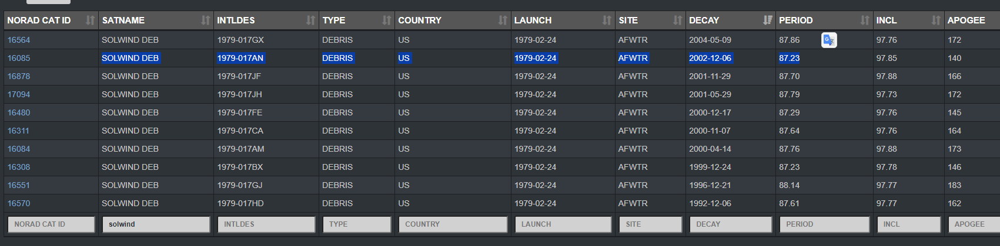

If you google the ASM-135 you notice its a missile that was used to destroy a solwind satellite.

I found this in the wikipedia article and I started searching about satcat and cospar. If you google COSPAR 1979-017GX one of the links is 

After some more searching I found I could search by the satellite name: 
https://www.n2yo.com/database/?q=SOLWIND+DEB#results 
which allows you to check debris but its difficult to search by when they decayed. 

ex:

I asked good ol chat gpt and it recommended space-track.org
I went ahead and created an account and searched for 
Solwind DEB

After some sorting there it is

so the flag would be PCTF{1979-017AN_2002-12-06}