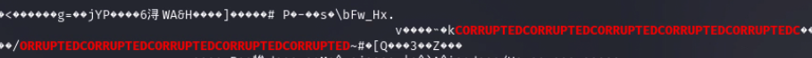
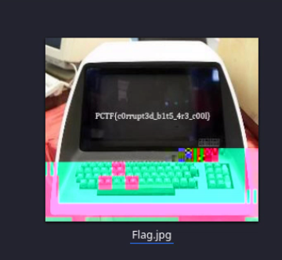

You download an image that seems very very corrupted. I tried exif data, and outguess and stegseek but found nothing. I then checked the strings and found a very funky line, 

The file contained plain text that read corrupted. I took a gamble and used nano to remove these lines and while the file is still corrupt, i saw an image in the small icon. If you zoom in you see the flag

