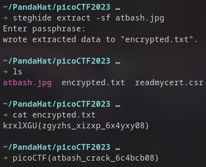

* HideToSee


**first we download the image**

**then we use command**

```
➜ steghide extract -sf atbash.jpg
```

**using no password.**

**then we get an encrypted.txt which we can decrypt using the image to go from** 
```
➜ cat encrypted.txt      
krxlXGU{zgyzhs_xizxp_6x4yxy08}
```
**to** 
```
➜ picoCTF{atbash_crack_6c4bcb08}
```




