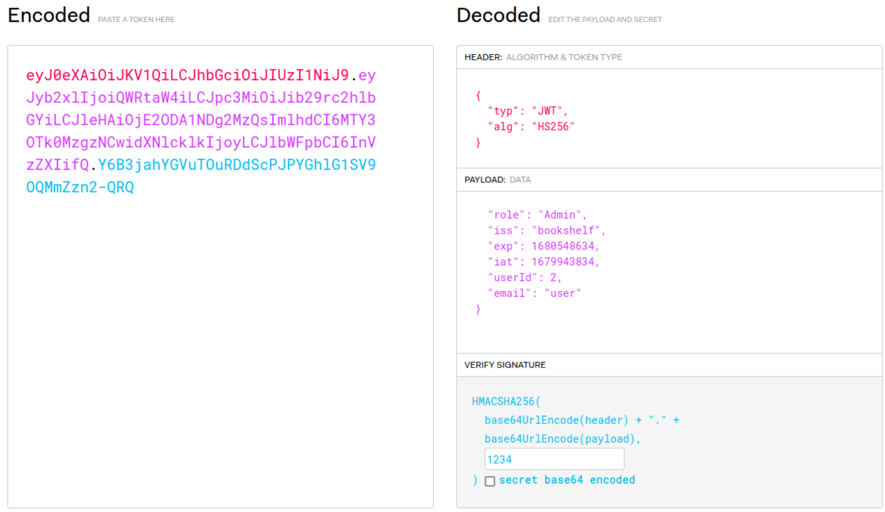
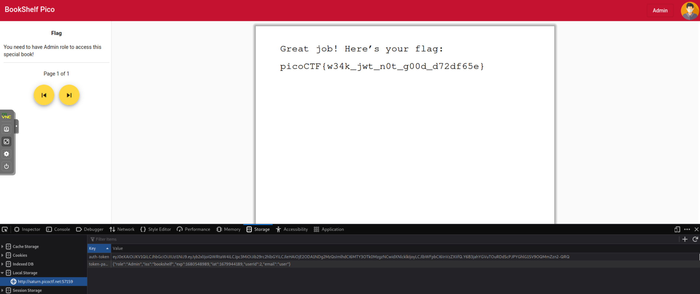

So this is a JWT token exploit

First you login with the given user info, *user* for both username and password

Then you get a JWT token, which you can shove in jwt.io to decode it.

you can see that the algo it uses is HS256, and it has a secret.

Using one of the hints you can see that the secret is in the code hardcoded somewhere. 

After searching a bit the files, you can see the *secretgenerator.jar* file. 

which has a function generateRandomString that returns *1234* no mater what.

that is used in the getServerSecret() function so you can assume thats the secret.

In JWT you can input a signature, so I inputted 1234 as the signature. Then I had to change the role, in the
bookshelfconfig.java file you can see it generates 2 users, User and Admin. So i assumed admin would have ID 2 and it has the fullname of Admin.

So i changed the role to Admin and the userId to 2. 

Replacing those values in the token, and refreshing you can access the flag.

